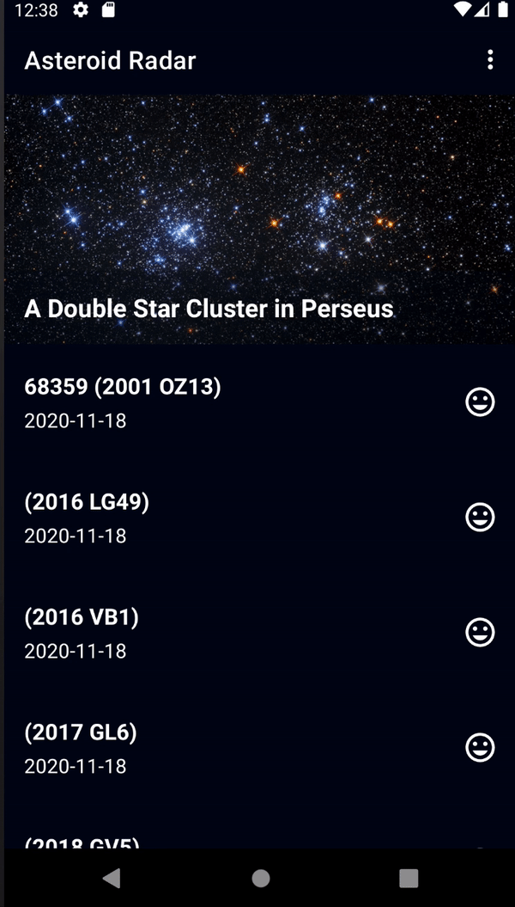

# Asteroid radar

Second project of the [Android Kotlin Developer Nanodegree course](https://www.udacity.com/course/android-kotlin-developer-nanodegree--nd940), has offline support.

## Getting Started

Download the project from [Github](https://github.com/RicardoBravoA/AsteroidRadar), the updated branch is **master**

### Dependencies

This project uses the following dependencies

- [ConstraintLayout](https://developer.android.com/training/constraint-layout)
- [Navigation Components](https://developer.android.com/guide/navigation/navigation-getting-started)
- [Room](https://developer.android.com/topic/libraries/architecture/room)
- [WorkManager](https://developer.android.com/jetpack/androidx/releases/work)
- [Retrofit](https://square.github.io/retrofit/)
- [Moshi](https://github.com/square/moshi)


### Installation

For now it has 2 environments.

```
debug
release
```

## Testing

For now there are no tests.

## Project Instructions

The project has this features.

<p align="center">
  <br>
</p>

- Main
    - Load the asteroids of the week (initial)
    - Accessibility support
    - Offline support
    - Menu with options
        - Asteroids of the week
        - Asteroids of the day
        - Asteroids saved in database
- Detail
    - Accessibility support
    - Shows image if the asteroid is potential

## License

    Copyright 2020 Ricardo Bravo (Woz).

    Licensed under the Apache License, Version 2.0 (the "License");
    you may not use this file except in compliance with the License.
    You may obtain a copy of the License at

       http://www.apache.org/licenses/LICENSE-2.0

    Unless required by applicable law or agreed to in writing, software
    distributed under the License is distributed on an "AS IS" BASIS,
    WITHOUT WARRANTIES OR CONDITIONS OF ANY KIND, either express or implied.
    See the License for the specific language governing permissions and
    limitations under the License.